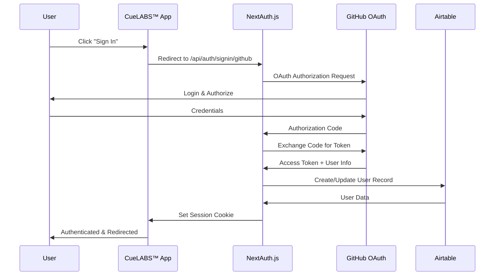

# Authentication API

## Overview

The Authentication API handles user authentication using NextAuth.js with GitHub OAuth provider. All authentication endpoints are managed by NextAuth.js and follow OAuth 2.0 standards.

## Authentication Flow



## Endpoints

### Get Current Session

Retrieve the current user's session information.

```http
GET /api/auth/session
```

#### Response

**Authenticated User (200)**

```json
{
  "user": {
    "id": "rec1234567890",
    "name": "John Doe",
    "email": "john.doe@example.com",
    "image": "https://avatars.githubusercontent.com/u/12345?v=4"
  },
  "expires": "2024-01-01T00:00:00.000Z"
}
```

**Unauthenticated (200)**

```json
null
```

#### Example Request

```bash
curl -X GET "https://cuelabs.cuesoft.io/api/auth/session" \
  -H "Cookie: next-auth.session-token=eyJhbGciOiJIUzI1NiJ9..."
```

---

### Sign In

Initiate the authentication process with GitHub OAuth.

```http
GET /api/auth/signin/github
```

#### Query Parameters

| Parameter | Type | Required | Description |
|-----------|------|----------|-------------|
| `callbackUrl` | string | No | URL to redirect after successful authentication |

#### Response

**Redirect (302)**
Redirects to GitHub OAuth authorization URL.

#### Example Request

```bash
curl -X GET "https://cuelabs.cuesoft.io/api/auth/signin/github?callbackUrl=/dashboard" \
  -L
```

---

### Sign Out

Sign out the current user and invalidate their session.

```http
POST /api/auth/signout
```

#### Request Body

```json
{
  "callbackUrl": "/login"
}
```

#### Response

**Success (200)**

```json
{
  "url": "/login"
}
```

#### Example Request

```bash
curl -X POST "https://cuelabs.cuesoft.io/api/auth/signout" \
  -H "Content-Type: application/json" \
  -H "Cookie: next-auth.session-token=..." \
  -d '{"callbackUrl": "/login"}'
```

---

### OAuth Callback

Handle the OAuth callback from GitHub (automatically handled by NextAuth.js).

```http
GET /api/auth/callback/github
```

#### Query Parameters

| Parameter | Type | Required | Description |
|-----------|------|----------|-------------|
| `code` | string | Yes | Authorization code from GitHub |
| `state` | string | Yes | State parameter for security |

#### Response

**Success (302)**
Redirects to the application with session established.

**Error (400)**

```json
{
  "error": "OAuthCallback",
  "message": "OAuth callback error details"
}
```

---

### Get Providers

Get available authentication providers.

```http
GET /api/auth/providers
```

#### Response

**Success (200)**

```json
{
  "github": {
    "id": "github",
    "name": "GitHub",
    "type": "oauth",
    "signinUrl": "/api/auth/signin/github",
    "callbackUrl": "/api/auth/callback/github"
  }
}
```

---

### CSRF Token

Get CSRF token for form submissions.

```http
GET /api/auth/csrf
```

#### Response

**Success (200)**

```json
{
  "csrfToken": "a1b2c3d4e5f6g7h8i9j0k1l2m3n4o5p6"  // pragma: allowlist secret
}
```

## Session Management

### Session Structure

```typescript
interface Session {
  user: {
    id: string;          // Airtable record ID
    name: string;        // GitHub display name
    email: string;       // GitHub email
    image?: string;      // GitHub avatar URL
  };
  expires: string;       // ISO date string
}
```

### Session Storage

Sessions are stored using:

- **Cookies**: Secure, HTTP-only session cookies
- **JWT**: Signed JSON Web Tokens for session data
- **Database**: Session persistence in Airtable (optional)

### Session Configuration

```typescript
// NextAuth.js configuration
export const authOptions = {
  providers: [
    GitHubProvider({
      clientId: process.env.GITHUB_CLIENT_ID,
      clientSecret: process.env.GITHUB_CLIENT_SECRET,
    })
  ],
  callbacks: {
    async signIn({ user, account, profile }) {
      // Custom sign-in logic
      return true;
    },
    async session({ session, token }) {
      // Customize session object
      return session;
    },
    async jwt({ token, user, account }) {
      // Customize JWT token
      return token;
    }
  },
  pages: {
    signIn: '/platform/auth/login',
    error: '/platform/auth/error',
  }
}
```

## Error Handling

### Common Error Types

| Error | Description | Resolution |
|-------|-------------|------------|
| `Configuration` | NextAuth.js configuration error | Check environment variables |
| `AccessDenied` | User denied OAuth authorization | User must authorize the application |
| `Verification` | Email verification failed | Check email configuration |
| `OAuthCallback` | OAuth callback error | Check GitHub OAuth app settings |
| `SessionRequired` | Protected route accessed without session | Redirect to sign-in |

### Error Response Format

```json
{
  "error": "AccessDenied",
  "message": "Access denied. Please authorize the application.",
  "url": "/api/auth/error?error=AccessDenied"
}
```

## Security Features

### CSRF Protection

- CSRF tokens generated for all form submissions
- Automatic validation of CSRF tokens
- Protection against cross-site request forgery

### Session Security

- Secure, HTTP-only cookies
- SameSite cookie attribute for CSRF protection
- Automatic session rotation
- Configurable session expiration

### OAuth Security

- State parameter validation
- PKCE (Proof Key for Code Exchange) support
- Secure redirect URI validation
- Token encryption and signing

## Environment Configuration

### Required Environment Variables

```bash
# NextAuth.js Configuration
NEXTAUTH_URL=https://cuelabs.cuesoft.io
NEXTAUTH_SECRET=your-secret-key-here

# GitHub OAuth
GITHUB_CLIENT_ID=your-github-client-id
GITHUB_CLIENT_SECRET=your-github-client-secret
```

### GitHub OAuth App Setup

1. **Create GitHub OAuth App**
   - Go to GitHub Settings > Developer settings > OAuth Apps
   - Click "New OAuth App"
   - Set Authorization callback URL: `https://cuelabs.cuesoft.io/api/auth/callback/github`

2. **Configure Application**
   - Application name: "CueLABS™ Platform"
   - Homepage URL: `https://cuelabs.cuesoft.io`
   - Authorization callback URL: `https://cuelabs.cuesoft.io/api/auth/callback/github`

3. **Get Credentials**
   - Copy Client ID and Client Secret
   - Add to environment variables

## Rate Limits

| Endpoint | Limit | Window |
|----------|-------|--------|
| `/api/auth/session` | 100 requests | 1 minute |
| `/api/auth/signin/*` | 10 requests | 1 minute |
| `/api/auth/signout` | 20 requests | 1 minute |
| `/api/auth/callback/*` | 50 requests | 1 minute |

## Testing Authentication

### Test Session Endpoint

```bash
# Test with valid session
curl -X GET "http://localhost:3000/api/auth/session" \
  -H "Cookie: next-auth.session-token=..."

# Test without session
curl -X GET "http://localhost:3000/api/auth/session"
```

### Test Sign In Flow

```bash
# Initiate sign-in
curl -X GET "http://localhost:3000/api/auth/signin/github" \
  -L -c cookies.txt

# Check session after sign-in
curl -X GET "http://localhost:3000/api/auth/session" \
  -b cookies.txt
```

## Troubleshooting

### Common Issues

1. **"Configuration" Error**
   - Verify `NEXTAUTH_URL` matches your domain
   - Check `NEXTAUTH_SECRET` is set and secure
   - Ensure GitHub OAuth credentials are correct

2. **"OAuthCallback" Error**
   - Verify GitHub OAuth app callback URL
   - Check network connectivity to GitHub
   - Validate OAuth app is active

3. **Session Not Persisting**
   - Check cookie settings and domain
   - Verify HTTPS in production
   - Check session expiration settings

4. **Access Denied**
   - User must authorize the GitHub OAuth app
   - Check OAuth app permissions and scopes
   - Verify user has access to the organization (if applicable)
