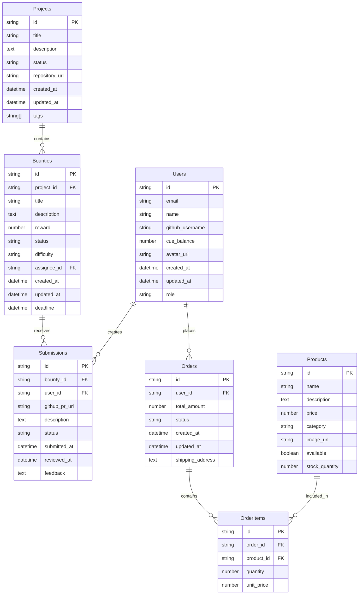

# Database Schema Documentation

## Overview

CueLABS™ uses Airtable as its primary database, providing a flexible and user-friendly interface for data management. This document outlines the complete database schema, relationships, and data models used throughout the platform.

## Airtable Base Structure

### Tables Overview

## Table Definitions

### Users Table

The Users table stores all platform user information and authentication data.

| Field Name | Type | Required | Description |
|------------|------|----------|-------------|
| id | Text (Primary Key) | Yes | Unique user identifier |
| email | Email | Yes | User's email address |
| name | Text | Yes | User's display name |
| github_username | Text | Yes | GitHub username for OAuth |
| cue_balance | Number | Yes | Current Cue Currency balance |
| avatar_url | URL | No | Profile picture URL |
| created_at | Date | Yes | Account creation timestamp |
| updated_at | Date | Yes | Last profile update timestamp |
| role | Single Select | Yes | User role (user, admin) |

**Validation Rules:**

- Email must be unique
- GitHub username must be unique
- Cue balance cannot be negative
- Role defaults to "user"

### Projects Table

The Projects table contains information about development projects available on the platform.

| Field Name | Type | Required | Description |
|------------|------|----------|-------------|
| id | Text (Primary Key) | Yes | Unique project identifier |
| title | Text | Yes | Project name |
| description | Long Text | Yes | Detailed project description |
| status | Single Select | Yes | Project status (active, completed, archived) |
| repository_url | URL | No | GitHub repository URL |
| created_at | Date | Yes | Project creation timestamp |
| updated_at | Date | Yes | Last project update timestamp |
| tags | Multiple Select | No | Project technology tags |

**Status Options:**

- active: Project is currently accepting contributions
- completed: Project has been finished
- archived: Project is no longer active

### Bounties Table

The Bounties table stores individual tasks and their reward information.

| Field Name | Type | Required | Description |
|------------|------|----------|-------------|
| id | Text (Primary Key) | Yes | Unique bounty identifier |
| project_id | Link to Projects | Yes | Associated project |
| title | Text | Yes | Bounty title |
| description | Long Text | Yes | Detailed task description |
| reward | Number | Yes | Cue Currency reward amount |
| status | Single Select | Yes | Bounty status |
| difficulty | Single Select | Yes | Task difficulty level |
| assignee_id | Link to Users | No | Assigned user (if any) |
| created_at | Date | Yes | Bounty creation timestamp |
| updated_at | Date | Yes | Last bounty update timestamp |
| deadline | Date | No | Bounty completion deadline |

**Status Options:**

- open: Available for assignment
- in_progress: Currently being worked on
- completed: Task has been finished
- cancelled: Bounty has been cancelled

**Difficulty Levels:**

- beginner: Suitable for new contributors
- intermediate: Requires some experience
- advanced: Complex task requiring expertise

### Submissions Table

The Submissions table tracks user submissions for bounties.

| Field Name | Type | Required | Description |
|------------|------|----------|-------------|
| id | Text (Primary Key) | Yes | Unique submission identifier |
| bounty_id | Link to Bounties | Yes | Associated bounty |
| user_id | Link to Users | Yes | Submitting user |
| github_pr_url | URL | Yes | GitHub pull request URL |
| description | Long Text | No | Submission description |
| status | Single Select | Yes | Review status |
| submitted_at | Date | Yes | Submission timestamp |
| reviewed_at | Date | No | Review completion timestamp |
| feedback | Long Text | No | Reviewer feedback |

**Status Options:**

- pending: Awaiting review
- approved: Submission accepted
- rejected: Submission declined
- revision_requested: Changes needed

### Products Table

The Products table contains marketplace items available for purchase.

| Field Name | Type | Required | Description |
|------------|------|----------|-------------|
| id | Text (Primary Key) | Yes | Unique product identifier |
| name | Text | Yes | Product name |
| description | Long Text | Yes | Product description |
| price | Number | Yes | Price in Cue Currency |
| category | Single Select | Yes | Product category |
| image_url | URL | No | Product image URL |
| available | Checkbox | Yes | Product availability |
| stock_quantity | Number | Yes | Available inventory |

**Category Options:**

- electronics: Tech gadgets and devices
- apparel: Clothing and accessories
- books: Technical books and resources
- software: Software licenses and tools

### Orders Table

The Orders table tracks user purchases from the marketplace.

| Field Name | Type | Required | Description |
|------------|------|----------|-------------|
| id | Text (Primary Key) | Yes | Unique order identifier |
| user_id | Link to Users | Yes | Purchasing user |
| total_amount | Number | Yes | Total order cost |
| status | Single Select | Yes | Order status |
| created_at | Date | Yes | Order creation timestamp |
| updated_at | Date | Yes | Last order update timestamp |
| shipping_address | Long Text | No | Delivery address |

**Status Options:**

- pending: Order placed, awaiting processing
- processing: Order being prepared
- shipped: Order has been shipped
- delivered: Order completed
- cancelled: Order cancelled

### OrderItems Table

The OrderItems table contains individual items within orders.

| Field Name | Type | Required | Description |
|------------|------|----------|-------------|
| id | Text (Primary Key) | Yes | Unique order item identifier |
| order_id | Link to Orders | Yes | Associated order |
| product_id | Link to Products | Yes | Ordered product |
| quantity | Number | Yes | Number of items |
| unit_price | Number | Yes | Price per item at time of order |

## Relationships

### One-to-Many Relationships

- **Users → Submissions**: One user can create multiple submissions
- **Users → Orders**: One user can place multiple orders
- **Projects → Bounties**: One project can have multiple bounties
- **Bounties → Submissions**: One bounty can receive multiple submissions
- **Orders → OrderItems**: One order can contain multiple items
- **Products → OrderItems**: One product can be in multiple orders

### Many-to-One Relationships

- **Submissions → Users**: Many submissions belong to one user
- **Submissions → Bounties**: Many submissions can be for one bounty
- **Bounties → Projects**: Many bounties belong to one project
- **Orders → Users**: Many orders belong to one user

## Data Validation

### Business Rules

1. **User Balance**: Cannot go below zero
2. **Bounty Assignment**: Only one user can be assigned per bounty
3. **Submission Uniqueness**: One submission per user per bounty
4. **Order Total**: Must match sum of order items
5. **Product Stock**: Cannot order more than available quantity

### Referential Integrity

- All foreign key relationships are enforced by Airtable
- Deletion of parent records requires handling of child records
- Orphaned records are prevented through relationship constraints

## Indexing Strategy

### Primary Indexes

- All tables have primary key indexes on `id` field
- Email field in Users table has unique index
- GitHub username in Users table has unique index

### Performance Indexes

- `status` fields across all tables for filtering
- `created_at` fields for chronological sorting
- `user_id` in Submissions and Orders for user-specific queries
- `project_id` in Bounties for project-specific queries
