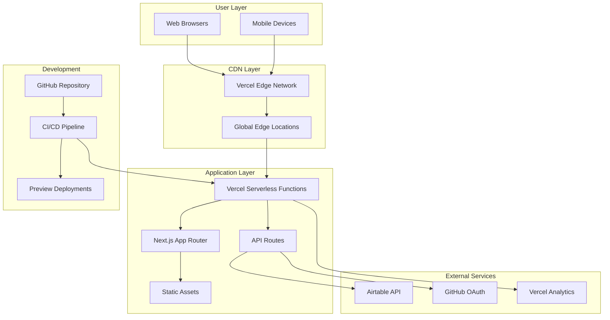
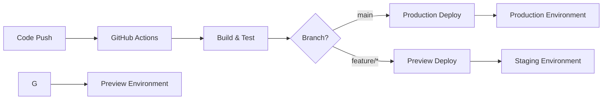

# Deployment Architecture

## Overview

CueLABS™ is deployed on Vercel's platform, leveraging Next.js's built-in deployment optimizations and Vercel's global edge network. This document outlines the deployment architecture, infrastructure components, and deployment strategies.

## Deployment Architecture Diagram



## Infrastructure Components

### Vercel Platform

- **Serverless Functions**: Auto-scaling compute for API routes
- **Edge Network**: Global CDN with 100+ edge locations
- **Static Generation**: Pre-built pages for optimal performance
- **Incremental Static Regeneration**: Dynamic content with static performance

### Next.js Deployment Features

- **Automatic Code Splitting**: Optimized bundle sizes
- **Image Optimization**: WebP conversion and responsive images
- **Font Optimization**: Automatic font loading optimization
- **Bundle Analysis**: Performance monitoring and optimization

## Environment Configuration

### Production Environment

```bash
# Application
NODE_ENV=production
NEXTAUTH_URL=https://cuelabs.cuesoft.io
NEXTAUTH_SECRET=<production-secret>

# Database
AIRTABLE_API_KEY=<production-key>
AIRTABLE_BASE_ID=<production-base-id>

# Authentication
GITHUB_CLIENT_ID=<production-client-id>
GITHUB_CLIENT_SECRET=<production-client-secret>

# Analytics
VERCEL_ANALYTICS_ID=<analytics-id>
```

### Staging Environment

```bash
# Application
NODE_ENV=production
NEXTAUTH_URL=https://staging-cuelabs.cuesoft.io
NEXTAUTH_SECRET=<staging-secret>

# Database
AIRTABLE_API_KEY=<staging-key>
AIRTABLE_BASE_ID=<staging-base-id>

# Authentication
GITHUB_CLIENT_ID=<staging-client-id>
GITHUB_CLIENT_SECRET=<staging-client-secret>
```

### Development Environment

```bash
# Application
NODE_ENV=development
NEXTAUTH_URL=http://localhost:3000
NEXTAUTH_SECRET=<development-secret>

# Database
AIRTABLE_API_KEY=<development-key>
AIRTABLE_BASE_ID=<development-base-id>

# Authentication
GITHUB_CLIENT_ID=<development-client-id>
GITHUB_CLIENT_SECRET=<development-client-secret>
```

## Deployment Pipeline

### Continuous Integration/Continuous Deployment (CI/CD)



### GitHub Actions Workflow

```yaml
name: Deploy to Vercel
on:
  push:
    branches: [main]
  pull_request:
    branches: [main]

jobs:
  deploy:
    runs-on: ubuntu-latest
    steps:
      - uses: actions/checkout@v4
      - uses: actions/setup-node@v4
        with:
          node-version: '22'
          cache: 'npm'

      - name: Install dependencies
        run: npm ci

      - name: Run tests
        run: npm run test

      - name: Build application
        run: npm run build

      - name: Deploy to Vercel
        uses: vercel/action@v1
        with:
          vercel-token: ${{ secrets.VERCEL_TOKEN }}
          vercel-org-id: ${{ secrets.ORG_ID }}
          vercel-project-id: ${{ secrets.PROJECT_ID }}
```

## Performance Optimization

### Build Optimization

- **Tree Shaking**: Removes unused code from bundles
- **Code Splitting**: Loads only necessary code per route
- **Bundle Analysis**: Monitors and optimizes bundle sizes
- **Compression**: Gzip and Brotli compression enabled

### Runtime Optimization

- **Server-Side Rendering**: Faster initial page loads
- **Static Generation**: Pre-built pages for maximum performance
- **Edge Caching**: Content cached at edge locations globally
- **Image Optimization**: Automatic WebP conversion and sizing

### Monitoring and Analytics

- **Vercel Analytics**: Real-time performance monitoring
- **Core Web Vitals**: Performance metrics tracking
- **Error Tracking**: Automatic error reporting and alerting
- **Usage Analytics**: User behavior and feature usage tracking

## Security Configuration

### HTTPS and SSL

- **Automatic HTTPS**: SSL certificates managed by Vercel
- **HSTS Headers**: HTTP Strict Transport Security enabled
- **Security Headers**: CSP, X-Frame-Options, and other security headers

### Environment Security

- **Secret Management**: Environment variables encrypted at rest
- **Access Control**: Team-based access to deployment settings
- **Audit Logging**: All deployment activities logged
- **Branch Protection**: Required reviews for production deployments

## Scaling Strategy

### Automatic Scaling

- **Serverless Functions**: Auto-scale based on demand
- **Edge Caching**: Reduces server load through global caching
- **Database Scaling**: Airtable handles scaling automatically
- **CDN Scaling**: Vercel's edge network scales globally

### Performance Monitoring

- **Real-time Metrics**: Function execution times and error rates
- **Resource Usage**: Memory and CPU utilization tracking
- **Cache Hit Rates**: CDN performance monitoring
- **User Experience**: Core Web Vitals and performance scores

## Disaster Recovery

### Backup Strategy

- **Code Repository**: GitHub provides version control and backup
- **Database Backup**: Airtable provides automatic backups
- **Environment Configuration**: Version controlled in repository
- **Deployment History**: Vercel maintains deployment history

### Recovery Procedures

- **Rollback Capability**: Instant rollback to previous deployments
- **Multi-region Deployment**: Automatic failover across regions
- **Health Checks**: Automatic detection of deployment issues
- **Incident Response**: Automated alerting and response procedures

## Cost Optimization

### Resource Management

- **Function Optimization**: Efficient serverless function usage
- **Caching Strategy**: Maximize cache hit rates to reduce compute
- **Bundle Optimization**: Minimize bundle sizes for faster loads
- **Image Optimization**: Reduce bandwidth through optimized images

### Monitoring and Alerts

- **Usage Tracking**: Monitor function executions and bandwidth
- **Cost Alerts**: Automated alerts for usage thresholds
- **Performance Budget**: Set limits on bundle sizes and performance
- **Resource Optimization**: Regular review of resource usage patterns
