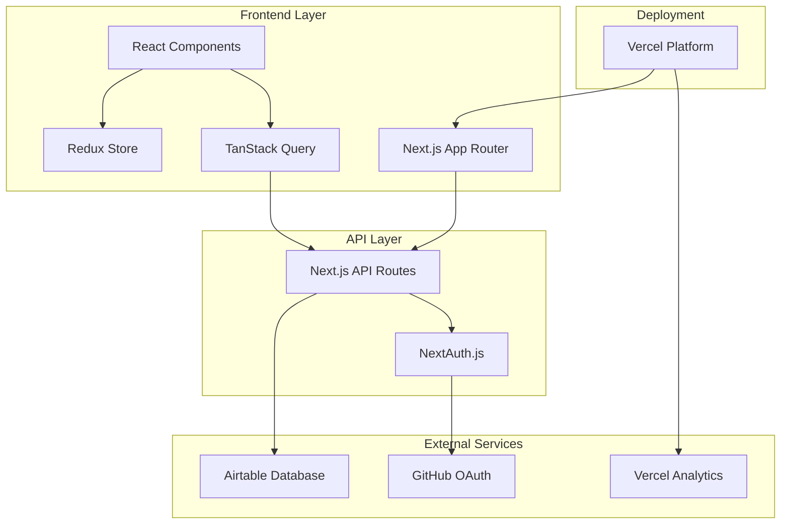
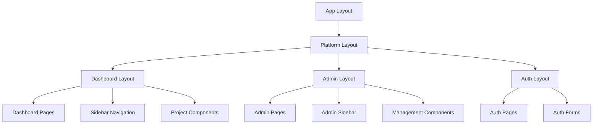
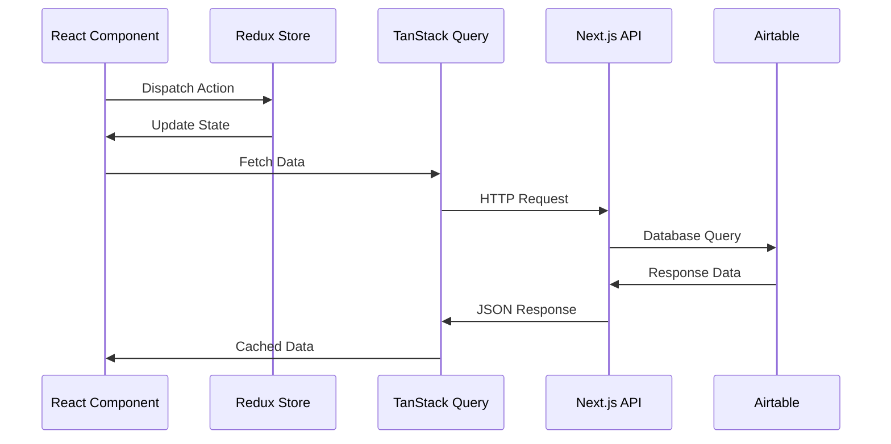
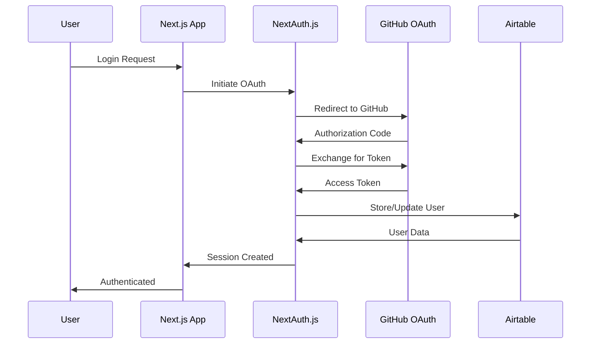

# System Architecture Overview

## Introduction

CueLABS™ is a Next.js-based developer platform that enables community-driven development through a bounty system, project management, and marketplace functionality. This document outlines the system architecture, component relationships, and technical implementation details.

## High-Level Architecture



## Technology Stack

### Frontend Framework

- **Next.js 15** with App Router for server-side rendering and routing
- **React 19** for component-based UI development
- **TypeScript 5** for type safety and enhanced developer experience

### State Management

- **Redux Toolkit** for global application state
- **Redux Persist** for state persistence across sessions
- **TanStack Query** for server state management and caching

### Styling & UI

- **Tailwind CSS 4** with custom design tokens
- **shadcn/ui** component library (New York style)
- **Radix UI** for accessible headless components
- **Lucide React** for consistent iconography

### Authentication & Data

- **NextAuth.js** for authentication management
- **Airtable** as the primary database and CMS
- **GitHub OAuth** for user authentication

## Component Architecture

### Application Structure

```
src/
├── app/                    # Next.js App Router
│   ├── api/               # API endpoints
│   ├── platform/          # Authenticated routes
│   │   ├── auth/         # Authentication pages
│   │   ├── dashboard/    # Main user interface
│   │   └── admin/        # Administrative interface
│   └── page.tsx          # Landing page
├── components/            # React components
│   ├── ui/               # Base UI components
│   └── custom/           # Application-specific components
├── hooks/                # Custom React hooks
├── lib/                  # Utility functions
├── store/                # Redux store configuration
└── types/                # TypeScript definitions
```

### Component Hierarchy



## Data Flow Architecture

### State Management Flow



### Authentication Flow



## Security Architecture

### Authentication & Authorization

- **NextAuth.js** handles OAuth flow and session management
- **GitHub OAuth** provides secure user authentication
- **Session-based** authentication with secure cookies
- **Role-based access control** for admin functionality

### Data Security

- **Environment variables** for sensitive configuration
- **API route protection** with authentication middleware
- **Input validation** on all API endpoints
- **HTTPS enforcement** in production

## Performance Architecture

### Caching Strategy

- **TanStack Query** for client-side data caching
- **Next.js** built-in caching for static assets
- **Vercel Edge Network** for global content delivery
- **Airtable API** rate limiting and optimization

### Optimization Techniques

- **Server-side rendering** for improved initial load times
- **Code splitting** with Next.js dynamic imports
- **Image optimization** with Next.js Image component
- **Bundle optimization** with webpack configuration
