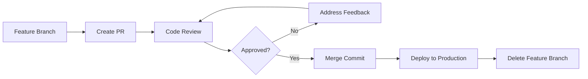
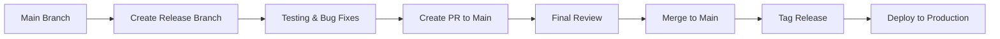
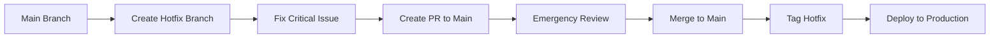

# Merge Procedures

## Overview

This document outlines the merge procedures for the CueLABS™ platform, including merge strategies, branch protection rules, and deployment workflows. Following these procedures ensures code quality and maintains a stable production environment.

## Merge Strategies

### 1. Merge Commit (Default)

**When to Use**: Feature branches merging to `main`

**Benefits**:

- Preserves complete development history
- Shows individual commit progression
- Maintains context of incremental changes
- Easier to track specific changes during development

**Process**:

```bash
# GitHub creates a merge commit preserving all commits
# Original commits are preserved:
# - feat: add user component
# - fix: resolve styling issue
# - test: add unit tests

# Plus merge commit:
# Merge pull request #123 from user/feature-branch
```

**Configuration**:

```json
// .github/settings.yml
branches:
  - name: main
    protection:
      required_status_checks:
        strict: true
        contexts: ["ci/build", "ci/test"]
      enforce_admins: false
      required_pull_request_reviews:
        required_approving_review_count: 1
        dismiss_stale_reviews: true
      restrictions: null
      allow_squash_merge: false
      allow_merge_commit: true
      allow_rebase_merge: false
```

### 2. Merge Commit

**When to Use**: Release branches merging to `main`

**Benefits**:

- Preserves branch history
- Shows feature groupings
- Maintains context of related changes
- Clear release boundaries

**Process**:

```bash
# Creates a merge commit that preserves branch structure
# Merge commit: "Merge pull request #456 from release/1.2.0"
# Preserves all individual commits from the release branch
```

### 3. Rebase and Merge

**When to Use**: Small, well-crafted commits that add individual value

**Benefits**:

- Linear history without merge commits
- Preserves individual commit messages
- Clean, readable history

**Process**:

```bash
# Replays commits individually on target branch
# Each commit appears as if it was made directly on target branch
```

## Branch Protection Rules

### Main Branch Protection

```yaml
# Branch: main
protection_rules:
  required_status_checks:
    strict: true
    contexts:
      - "ci/build"
      - "ci/test"
      - "ci/security-scan"
      - "ci/performance-test"

  required_pull_request_reviews:
    required_approving_review_count: 2
    dismiss_stale_reviews: true
    require_code_owner_reviews: true

  restrictions:
    users: []
    teams: ["maintainers"]

  enforce_admins: true
  allow_force_pushes: false
  allow_deletions: false

  merge_options:
    allow_squash_merge: false
    allow_merge_commit: true
    allow_rebase_merge: false
```

### Main Branch Protection

```yaml
# Branch: main
protection_rules:
  required_status_checks:
    strict: true
    contexts:
      - "ci/build"
      - "ci/test"
      - "ci/lint"

  required_pull_request_reviews:
    required_approving_review_count: 1
    dismiss_stale_reviews: true

  enforce_admins: false
  allow_force_pushes: false
  allow_deletions: false

  merge_options:
    allow_squash_merge: false
    allow_merge_commit: true
    allow_rebase_merge: false
```

## Merge Workflows

### Feature Branch Workflow



#### Step-by-Step Process

1. **Create Pull Request**

   ```bash
   # Push feature branch
   git push origin feature/123-user-dashboard

   # Create PR via GitHub CLI
   gh pr create --title "feat: implement user dashboard" \
                --body "Implements analytics dashboard for users" \
                --base main
   ```

2. **Automated Checks Run**
   - Build verification
   - Test suite execution
   - Code quality checks
   - Security scanning

3. **Code Review Process**
   - Assign reviewers
   - Address feedback
   - Request re-review

4. **Merge Requirements Met**
   - ✅ All status checks pass
   - ✅ Required approvals received
   - ✅ Branch is up to date
   - ✅ No merge conflicts

5. **Merge Commit**

   ```bash
   # Via GitHub UI or CLI
   gh pr merge --merge --delete-branch
   ```

6. **Automatic Deployment**
   - Staging deployment triggered
   - Notification sent to team

### Release Workflow



#### Step-by-Step Process

1. **Create Release Branch**

   ```bash
   git checkout main
   git pull origin main
   git checkout -b release/1.2.0

   # Update version
   npm version 1.2.0 --no-git-tag-version

   # Update changelog
   echo "## [1.2.0] - $(date +%Y-%m-%d)" >> CHANGELOG.md

   git add .
   git commit -m "chore(release): bump version to 1.2.0"
   git push -u origin release/1.2.0
   ```

2. **Testing and Stabilization**

   ```bash
   # Fix any critical issues found during testing
   git commit -m "fix(release): resolve critical authentication bug"
   git push origin release/1.2.0
   ```

3. **Create PR to Main**

   ```bash
   gh pr create --title "Release 1.2.0" \
                --body "Release version 1.2.0 with new features and bug fixes" \
                --base main \
                --head release/1.2.0
   ```

4. **Final Review and Merge**
   - Requires 2 approvals for main branch
   - All checks must pass
   - Merge commit strategy preserves release history

5. **Tag and Deploy**

   ```bash
   # After merge to main
   git checkout main
   git pull origin main
   git tag -a v1.2.0 -m "Release version 1.2.0"
   git push origin v1.2.0

   # Production deployment triggered automatically
   ```

6. **Clean Up**

   ```bash
   # Delete release branch after successful merge
   git branch -d release/1.2.0
   git push origin --delete release/1.2.0
   ```

### Hotfix Workflow



#### Step-by-Step Process

1. **Create Hotfix Branch**

   ```bash
   git checkout main
   git pull origin main
   git checkout -b hotfix/1.2.1-auth-fix
   ```

2. **Implement Fix**

   ```bash
   # Make minimal changes to fix the issue
   git add .
   git commit -m "fix: resolve authentication bypass vulnerability"
   git push -u origin hotfix/1.2.1-auth-fix
   ```

3. **Emergency Review Process**

   ```bash
   gh pr create --title "Hotfix 1.2.1: Fix authentication vulnerability" \
                --body "Critical security fix for authentication bypass" \
                --base main \
                --label "hotfix,security"
   ```

4. **Fast-Track Merge**
   - Expedited review process
   - Security team approval required
   - Immediate merge after approval

5. **Deploy and Merge Back**

   ```bash
   # Tag hotfix
   git tag -a v1.2.1 -m "Hotfix version 1.2.1"
   git push origin v1.2.1

   # Clean up hotfix branch
   git branch -d hotfix/1.2.1-auth-fix
   git push origin --delete hotfix/1.2.1-auth-fix
   ```

## Merge Conflict Resolution

### Prevention Strategies

1. **Keep Branches Updated**

   ```bash
   # Regularly rebase feature branches
   git fetch origin
   git rebase origin/main
   ```

2. **Small, Focused Changes**
   - Keep PRs small and focused
   - Merge frequently to reduce conflicts
   - Coordinate with team on overlapping work

3. **Communication**
   - Discuss major changes in advance
   - Use draft PRs for work in progress
   - Coordinate database schema changes

### Resolution Process

1. **Identify Conflicts**

   ```bash
   # GitHub will show merge conflicts in PR
   # Or when attempting to merge locally
   git merge origin/main
   # Auto-merging file.js
   # CONFLICT (content): Merge conflict in file.js
   ```

2. **Resolve Conflicts Locally**

   ```bash
   # Method 1: Rebase (preferred)
   git fetch origin
   git rebase origin/main

   # Edit conflicted files
   # Remove conflict markers: <<<<<<<, =======, >>>>>>>
   # Keep desired changes

   git add resolved-file.js
   git rebase --continue
   git push --force-with-lease origin feature/branch
   ```

3. **Alternative: Merge Method**

   ```bash
   # Method 2: Merge commit
   git fetch origin
   git merge origin/main

   # Resolve conflicts in files
   git add resolved-file.js
   git commit -m "resolve merge conflicts with main"
   git push origin feature/branch
   ```

### Complex Conflict Resolution

```bash
# For complex conflicts, use merge tools
git config --global merge.tool vimdiff
# or
git config --global merge.tool vscode

# Launch merge tool
git mergetool

# Or use VS Code
code --wait --merge source.js base.js target.js output.js
```

## Deployment Integration

### Automatic Deployments

```yaml
# .github/workflows/deploy.yml
name: Deploy
on:
  push:
    branches:
      - main        # Production deployment


jobs:
  deploy-production:
    if: github.ref == 'refs/heads/main'
    runs-on: ubuntu-latest
    steps:
      - uses: actions/checkout@v4
      - name: Deploy to Staging
        run: vercel --token ${{ secrets.VERCEL_TOKEN }}

  deploy-production:
    if: github.ref == 'refs/heads/main'
    runs-on: ubuntu-latest
    steps:
      - uses: actions/checkout@v4
      - name: Deploy to Production
        run: vercel --prod --token ${{ secrets.VERCEL_TOKEN }}
```

### Deployment Notifications

```yaml
# Slack notification after successful merge
- name: Notify Slack
  uses: 8398a7/action-slack@v3
  with:
    status: ${{ job.status }}
    text: "🚀 Deployed to production: ${{ github.event.head_commit.message }}"
  env:
    SLACK_WEBHOOK_URL: ${{ secrets.SLACK_WEBHOOK }}
```

## Quality Gates

### Pre-Merge Checks

1. **Automated Testing**

   ```yaml
   # Required status checks
   - ci/build          # Build succeeds
   - ci/test           # All tests pass
   - ci/lint           # Code style checks
   - ci/type-check     # TypeScript validation
   - ci/security       # Security vulnerability scan
   ```

2. **Code Coverage**

   ```yaml
   # Maintain or improve coverage
   - name: Check Coverage
     run: |
       npm run test:coverage
       npx codecov
   ```

3. **Performance Checks**

   ```yaml
   # Bundle size analysis
   - name: Bundle Analysis
     run: |
       npm run build
       npx bundlesize
   ```

### Manual Review Requirements

1. **Code Review Checklist**
   - [ ] Functionality works as expected
   - [ ] Code follows project standards
   - [ ] Tests are adequate
   - [ ] Documentation is updated
   - [ ] No security vulnerabilities

2. **Approval Requirements**
   - Feature branches: 1 approval
   - Release branches: 2 approvals
   - Hotfix branches: 1 security team approval

## Rollback Procedures

### Immediate Rollback

```bash
# Rollback production deployment
vercel rollback [deployment-url] --token ${{ secrets.VERCEL_TOKEN }}

# Or revert the merge commit
git revert -m 1 <merge-commit-hash>
git push origin main
```

### Planned Rollback

```bash
# Create revert PR
git checkout main
git pull origin main
git revert -m 1 <merge-commit-hash>
git checkout -b revert/problematic-feature
git push -u origin revert/problematic-feature

# Create PR for revert
gh pr create --title "Revert: problematic feature" \
             --body "Reverting due to production issues" \
             --base main
```

## Monitoring and Metrics

### Merge Metrics

Track the following metrics to improve the process:

1. **Time to Merge**
   - Time from PR creation to merge
   - Time spent in review
   - Time to address feedback

2. **Quality Metrics**
   - Number of bugs found in review vs production
   - Test coverage trends
   - Code quality scores

3. **Process Metrics**
   - Number of merge conflicts
   - Rollback frequency
   - Deployment success rate

### Automation Tools

```yaml
# GitHub Actions for metrics collection
- name: Collect Metrics
  uses: ./.github/actions/collect-metrics
  with:
    pr-number: ${{ github.event.number }}
    merge-time: ${{ steps.merge.outputs.time }}
```

## Troubleshooting

### Common Issues

1. **Status Checks Failing**

   ```bash
   # Re-run failed checks
   gh pr checks --watch

   # Fix issues and push
   git add .
   git commit -m "fix: resolve failing tests"
   git push origin feature/branch
   ```

2. **Merge Button Disabled**
   - Check all required status checks pass
   - Ensure required approvals are received
   - Verify branch is up to date with base
   - Check for merge conflicts

3. **Deployment Failures**

   ```bash
   # Check deployment logs
   vercel logs [deployment-url]

   # Rollback if necessary
   vercel rollback [deployment-url]
   ```

### Emergency Procedures

1. **Production Down**
   - Immediate rollback to last known good deployment
   - Create hotfix branch for urgent fixes
   - Fast-track review process
   - Deploy fix as soon as possible

2. **Security Vulnerability**
   - Create private security advisory
   - Create fix in private repository
   - Coordinate disclosure timeline
   - Deploy fix across all environments

## Best Practices Summary

### Do's ✅

- Keep PRs small and focused
- Write clear commit messages
- Test changes thoroughly before requesting review
- Respond to review feedback promptly
- Keep branches up to date with base branch
- Use appropriate merge strategy for the situation

### Don'ts ❌

- Don't merge without proper review
- Don't force push to shared branches
- Don't merge with failing tests
- Don't ignore merge conflicts
- Don't skip the review process for "small" changes
- Don't merge late on Fridays (unless emergency)
